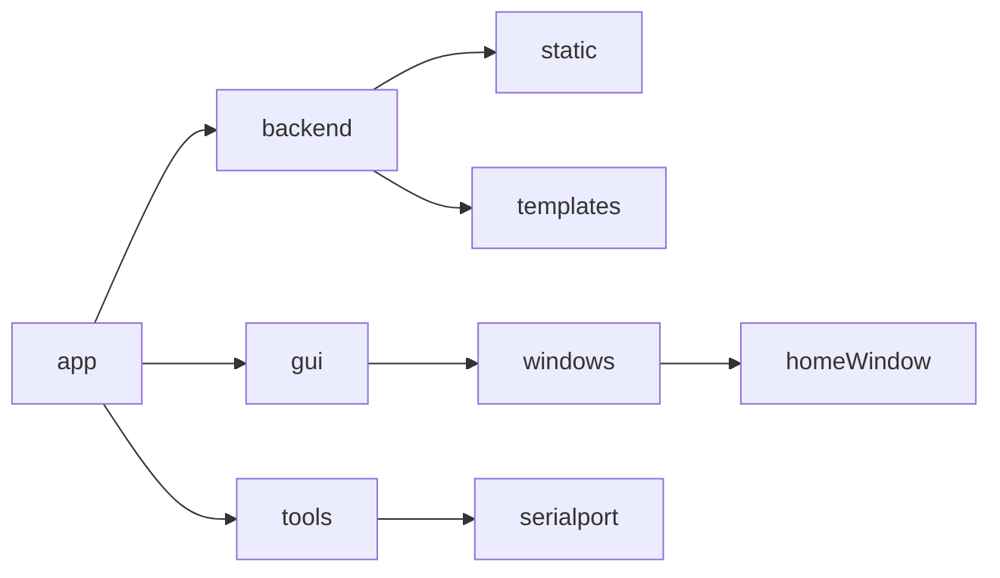

# serialTools

### 人生苦短，我用python！    

> pip 依赖包

- flask
    - flask-socketio
        - simple-websocket
    - flask-sqlalchemy
    - bootstrap-flask
    - flask-login
    - flask-restful
- pandas
- pytorch
- python-opencv
- SQLAlchemy
- Matplotlib
- pyserial

## 项目结构    

